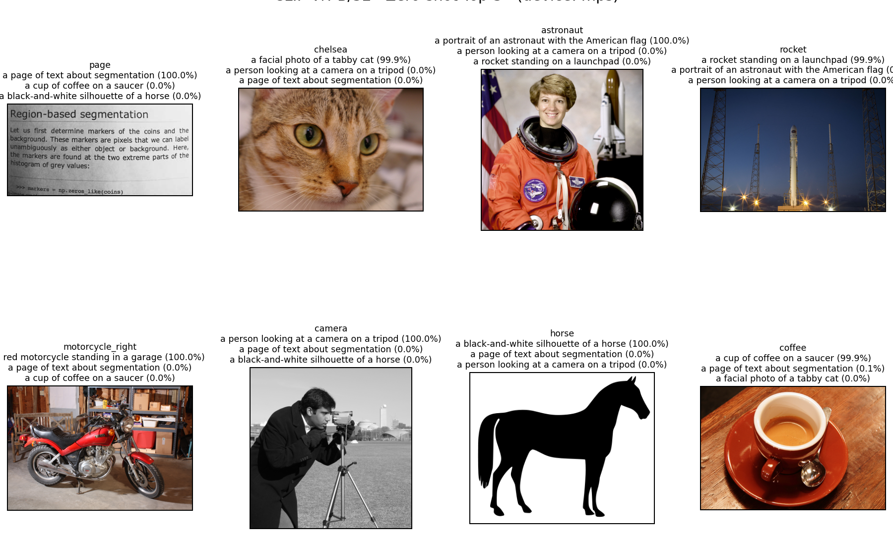
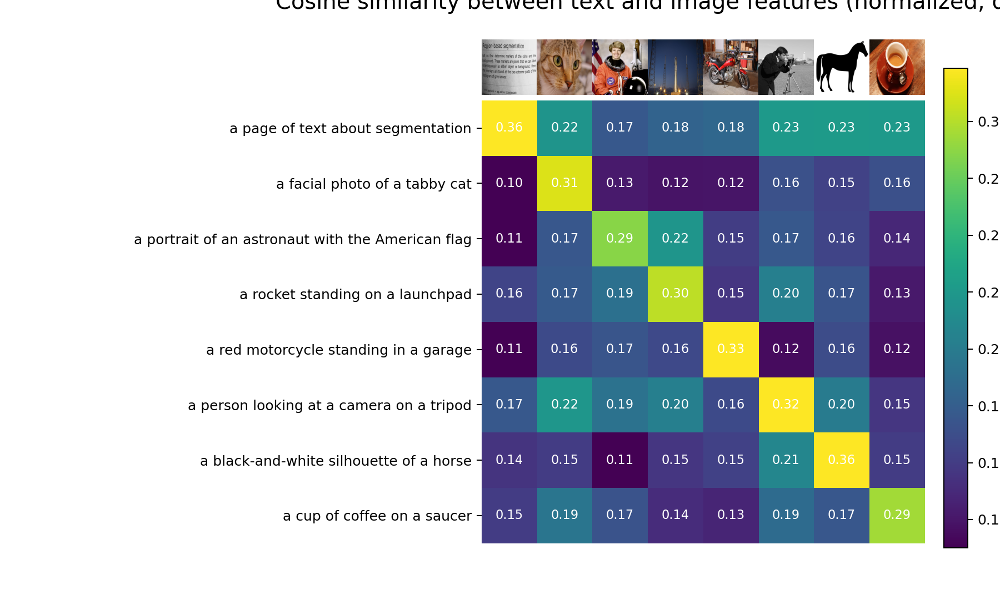
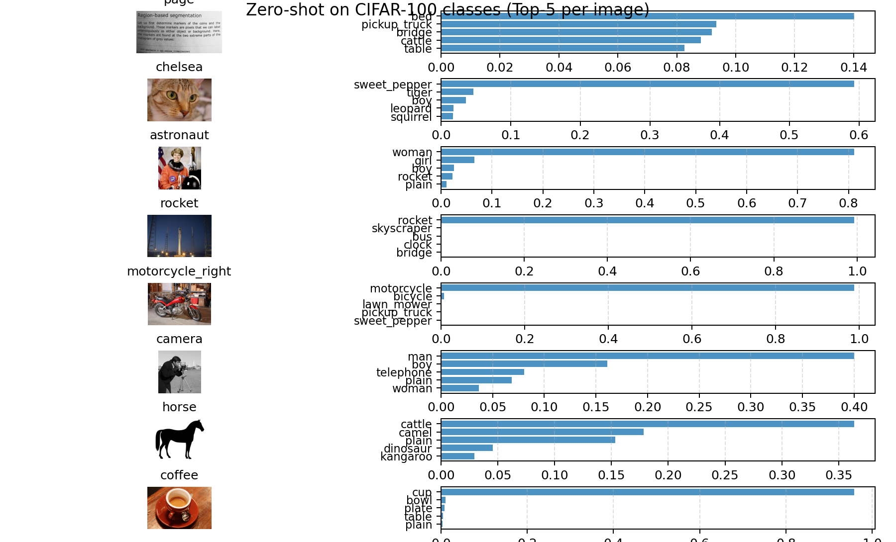

# 实验报告：CLIP 模型 Zero-shot 评估

## 1. 实验目的
1. 复现 OpenAI **CLIP (ViT-B/32)** 模型的 **zero-shot 学习能力**。  
2. 在 **自定义图像+描述集** 上测试模型的图文对齐效果。  
3. 在 **CIFAR-100** 上做 zero-shot 可视化，观察 CLIP 的跨数据集泛化能力。  
4. 在 **ImageNet-V2** 上进行完整的 zero-shot 评估，并与论文结果进行对比。

---

## 2. 实验环境
- **硬件**：MacBook Pro, Apple Silicon (M4 Pro, MPS 加速)  
- **软件栈**：
  - Python 3.12
  - PyTorch 2.8.0 (`mps` backend)
  - OpenAI CLIP (`ViT-B/32`)
  - torchvision, tqdm, matplotlib, scikit-image
- **模型参数**：
  - Parameters: **151M**
  - Input resolution: **224**
  - Context length: **77**
  - Vocabulary size: **49408**

---

## 3. 实验一：自定义图像 + 文本匹配

### 数据
- 使用 `scikit-image` 自带图片 (`page`, `chelsea`, `astronaut`, `rocket`, `motorcycle_right`, `camera`, `horse`, `coffee`)  
- 为每张图片定义自然语言描述，例如：
  - `chelsea`: "a facial photo of a tabby cat"  
  - `rocket`: "a rocket standing on a launchpad"

### 方法
- 输入图片经过 CLIP 图像编码器 (`ViT-B/32`)  
- 输入文本描述经过 CLIP 文本编码器  
- 计算 **余弦相似度**，并对比预测概率  

### 结果
- 模型对齐效果极佳，所有图片与对应描述的匹配概率接近 **100%**：  

- [page] = 100.00%
   [chelsea] = 99.98%
   [astronaut] = 99.98%
   [rocket] = 99.96%
   [motorcycle_right] = 100.00%
   [camera] = 99.99%
   [horse] = 100.00%
   [coffee] = 99.88%

- ### 可视化
  - **Top-3 预测结果展示**  
  

  - **相似度热力图**  
  

  ## 4. 实验二：CIFAR-100 Zero-shot 可视化

  ### 数据
  - 使用 CIFAR-100 的 100 类标签（共 100 个 text prompts）  
  - 选择部分自定义图片输入，查看它们在 100 类上的 zero-shot 分布  
  
  ### 结果
  - 模型在 CIFAR-100 上的 **Top-5 预测分布**合理：  
  - `rocket` → top-1 为 “rocket” 类  
  - `motorcycle_right` → top-1 为 “motorcycle” 类  
  - `chelsea`（猫）→ top-1 为 “sweet_pepper” （误差较大，受 CIFAR-100 粗粒度和分辨率影响）  
  
  ### 可视化
  - **每张图片的 CIFAR-100 Top-5 bar chart**  
  
  
  ---

  ## 5. 实验三：ImageNet-V2 Zero-shot 基准

  ### 数据
  - **ImageNet-V2** (10,000 张图片, 1000 类别, matched-frequency split)
  
  ### 方法
  - 使用 **20 个 prompt templates** 进行 prompt ensembling，例如：  
  - "a photo of a {}."  
  - "a blurry photo of a {}."  
  - "a black and white photo of a {}."  
  - 每个类别生成多个文本嵌入，取平均作为分类器权重。  
  - Zero-shot 推理：  
  \[
  \text{logits} = 100 \cdot \cos(\text{image\_features}, \text{text\_features})
  \]
  
  ### 结果
  - **Top-1 = 54.80%**  
  - **Top-5 = 82.09%**
  
  ### 对比论文基准
  | 模型                              | 数据集    | Top-1     | Top-5 |
  | --------------------------------- | --------- | --------- | ----- |
  | CLIP ViT-B/32 (论文, ImageNet)    | 63.1%     | 85.5%     |       |
  | CLIP ViT-B/32 (论文, ImageNet-V2) | ~55%      | ~82%      |       |
  | **本实验 (ImageNet-V2)**          | **54.8%** | **82.1%** |       |
  
  ## 6. 结论

  1. **自定义小规模实验**：CLIP 能够稳健对齐图片和文本，Top-1 匹配率接近 100%。  
  2. **CIFAR-100 Zero-shot 可视化**：能捕捉大类语义，但在细粒度 CIFAR-100 上表现有限。  
  3. **ImageNet-V2 Zero-shot 评估**：结果与论文一致（Top-1≈55%，Top-5≈82%），验证了 CLIP 在跨分布下的泛化能力。  
  4. **改进方向**：
   - 增加 prompt 模板数（论文里用过 80 个，可提升 2–3% Top-1）；  
   - 使用更大模型（ViT-B/16, ViT-L/14）能进一步提高性能。